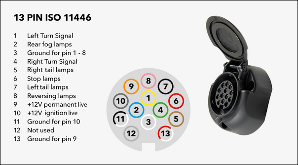
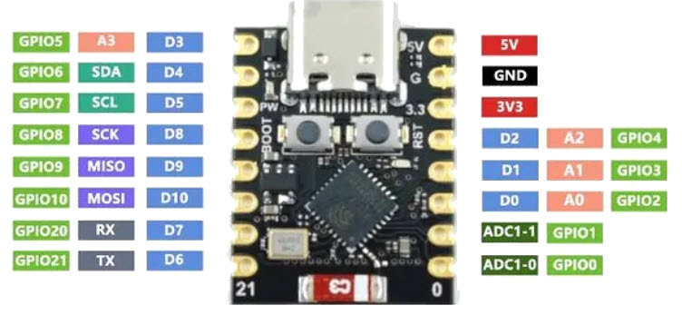
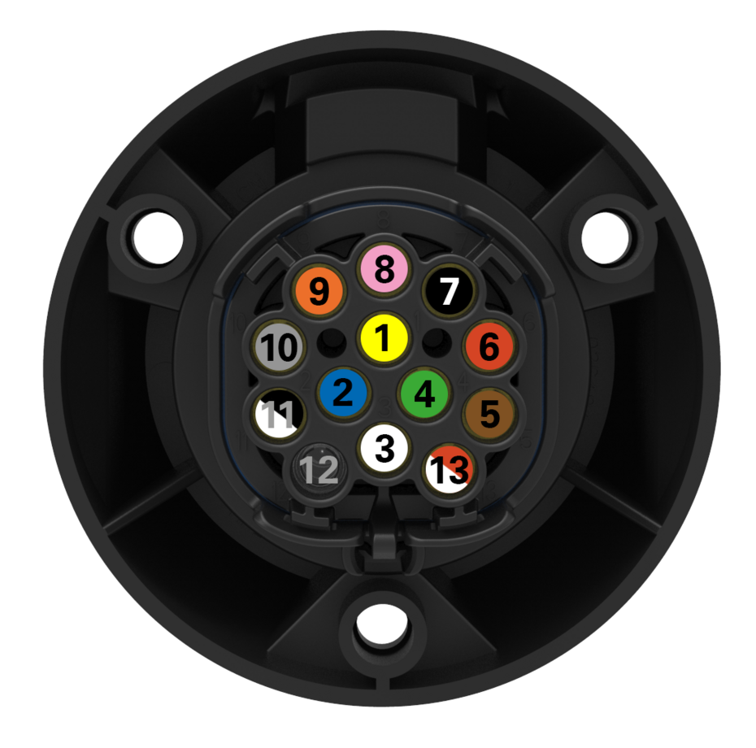
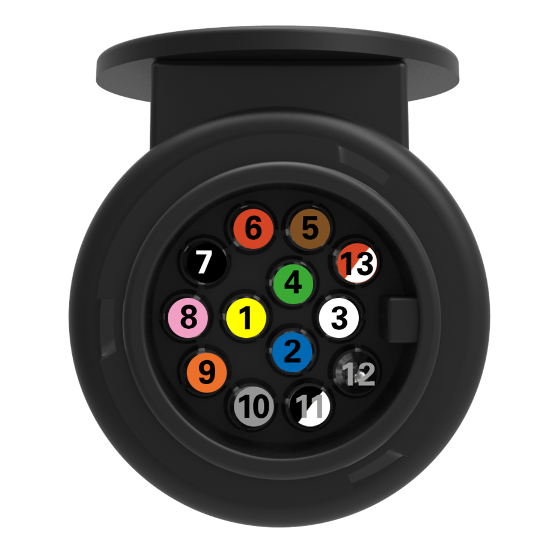

<!-- PROJECT SHIELDS -->
[![Contributors][contributors-shield]][contributors-url]
[![Forks][forks-shield]][forks-url]
[![Stargazers][stars-shield]][stars-url]
[![Issues][issues-shield]][issues-url]
[![MIT License][license-shield]][license-url]
[![LinkedIn][linkedin-shield]][linkedin-url]

<!-- PROJECT LOGO -->
 

<!-- TABLE OF CONTENTS -->

  
Table of Contents

  <ol>
    <li><a href="#about-the-project">About The Project</a><ul><li><a href="#built-with">Built With</a></li></ul></li>
    <li><a href="#getting-started">Getting Started</a></li>
    <li><a href="#webpage">Web Page</a></li>
    <li><a href="#roadmap">Roadmap</a></li>
    <li><a href="#license">License</a></li>
    <li><a href="#contact">Contact</a></li>
    <li><a href="#acknowledgements">Acknowledgements</a></li>
    <li><a href="#iso-11446">ISO 11446</a></li>
    <li><a href="#pin-definitions">Pin Definitions</a></li>
    
  </ol>

<!-- ABOUT THE PROJECT -->
## About The Project

This covers a wireless 13-pin Car Connector Tester using BlueTooth Low Energy Link (BLE)

You insert a plug in the cars connector and this power a wireless transmitter that you can connect to from you mobile phone
The plug powers up the BLE link from the permanent +12V from the plug

You can then see the status on all pins via the user interface on your phone without a cable out of the door.

The Tester will have different modes:
* Mode 1: A graphical representation of the Connector where each pin lights up when 12V og GND is connected
* Mode 2: A Table list structured in groups (ie. Blink Left, Blink Right near to each other
* Mode 3: A latching mode - So the that has been tested stays on
* Mode 4: FUTURE: Connection to CAN bus so that the tester and initiate each test by itself

:smile:

### Built With

The code is build with Arduino which supports the ESP32 modules
* [Arduiono IDE 2.3.3](https://www.arduino.cc/en/software)

* Choose the module: "ESP32C3 Dev Module" for the ESP32-C3-Super-Mini module in Arduino IDE 

<!-- GETTING STARTED -->
## Getting Started

I'm using the ESP32 Board called "ESP32-C3-Super-Mini". This board have both Wi-Fi and Bluetooth 5 

* [Link to a Danish Webshop](https://ardustore.dk/produkt/esp32-c3-super-mini-wifi-4mb-ble5-udviklingsboard)
The ESP32 C3 Super Mini is a low power and small outline of the bigger ESP32-C3 board.

This is the pin numbers and definitions that can be used with Arduino:
<li>static const uint8_t TX   = 21;</li>
<li>static const uint8_t RX   = 20;</li>

<li>static const uint8_t SDA  = 8;</li>
<li>static const uint8_t SCL  = 9;</li>

<li>static const uint8_t SS   = 7;</li>
<li>static const uint8_t MOSI = 6;</li>
<li>static const uint8_t MISO = 5;</li>
<li>static const uint8_t SCK  = 4;</li>

<li>static const uint8_t A0   = 0;</li>
<li>static const uint8_t A1   = 1;</li>
<li>static const uint8_t A2   = 2;</li>
<li>static const uint8_t A3   = 3;</li>
<li>static const uint8_t A4   = 4;</li>
<li>static const uint8_t A5   = 5;</li>

<!-- WEBPAGE -->
## Webpage
[The index.html file can be tested from here within this Gitbub repository: ](https://koch-engineering.github.io/PinPoint_BLE/)

<!-- ROADMAP -->
## Roadmap
See the [open issues](https://github.com/othneildrew/Best-README-Template/issues) for a list of proposed features (and known issues).

<!-- LICENSE -->
## License
Distributed under the MIT License. See `LICENSE` for more information.

<!-- CONTACT -->
## Contact

Henrik Johansen Koch - [@henrikjkoch](https://x.com/henrikjkoch) - henrik@koch-engineering.com

Project Link: [[[https://github.com/KOCH-Engineering/PinPoint_BLE/]](https://github.com/KOCH-Engineering/PinPoint_BLE/)  This!

<!-- ACKNOWLEDGEMENTS -->
## Acknowledgements
* [Github](https://www.github.com)
* [Arduino](https://www.arduino.cc/)
* [Link to BLE Code Examples](https://randomnerdtutorials.com/esp32-web-bluetooth/)
* [Link to how to use iOS](https://github.com/akiofujita/iOS-BLE)
* [Another article on iOS BLE](https://leonardocavagnis.medium.com/from-arduino-programming-to-ios-app-development-8b5da1783e1e)
* [Hackaday article about BLE](https://hackaday.com/2018/08/03/beginning-ble-experiments-and-making-everything-better/)
* [something about ESP32-C3-Mini Expansion board](https://michiel.vanderwulp.be/domotica/Modules/ESP32-C3-SuperMini/)
* [Serial debug problems - maybe a solution](https://www.esp32.com/viewtopic.php?t=32621)

#Standards
## ISO 11446
* [Link to the ISO 11446 standard](https://en.wikipedia.org/wiki/ISO_11446)
ISO 11446:2004 specifies a 13-pole electrical connector between towing and towed vehicles with 12 volt electrical system. It was developed in 1987 by [Erich Jaeger](https://www.erich-jaeger.com/en/products/standards/iso-11446/iso-11446-scope-and-application) to replace older 7-pin plugs.

## ISO 12098

## CAN 
CAN bus-compatible controllers is called TWAI, which stands for Two-Wire Automotive Interface.

## ISO 11898-1 protocol (CAN Specification 2.0)
TJA1050 High-Speed CAN Transceiver ([datasheet](https://www.nxp.com/docs/en/data-sheet/TJA1050.pdf))

* [TWAI controller](https://lastminuteengineers.com/esp32-can-bus-tutorial/?utm_content=cmp-true)
 

## Pin Definitions

<li>Pin 1	 Left indicator [Blink Venstre]</li>
<li>Pin 2	 Rear fog lamp [Tågelys bag]</li>
<li>Pin 3	 Ground [a]<tab>Stel</li>
<li>Pin 4	 Right indicatorBlink Højre</li>
<li>Pin 5	 Right tail lamp [b]Højre baglys</li>
<li>Pin 6	 Brake lamp<tab>Bremselys</tab></li>
<li>Pin 7	 Left tail lamp[b]</li>
<li>Pin 8	 Reverse lamp</li>
<li>Pin 9	 Permanent power</li>
<li>Pin 10	Switched supply (for fridge)</li>
<li>Pin 11	Ground for pin 10 [a]</li>
<li>Pin 12	Trailer Presence Detection[c]</li>
<li>Pin 13	Ground for pin 9 [a]</li>

<!-- MARKDOWN LINKS & IMAGES -->
<!-- https://www.markdownguide.org/basic-syntax/#reference-style-links -->
[contributors-shield]: https://img.shields.io/github/contributors/othneildrew/Best-README-Template.svg?style=for-the-badge
[contributors-url]: https://github.com/othneildrew/Best-README-Template/graphs/contributors
[forks-shield]: https://img.shields.io/github/forks/othneildrew/Best-README-Template.svg?style=for-the-badge
[forks-url]: https://github.com/othneildrew/Best-README-Template/network/members
[stars-shield]: https://img.shields.io/github/stars/othneildrew/Best-README-Template.svg?style=for-the-badge
[stars-url]: https://github.com/othneildrew/Best-README-Template/stargazers
[issues-shield]: https://img.shields.io/github/issues/othneildrew/Best-README-Template.svg?style=for-the-badge
[issues-url]: https://github.com/othneildrew/Best-README-Template/issues
[license-shield]: https://img.shields.io/github/license/othneildrew/Best-README-Template.svg?style=for-the-badge
[license-url]: https://github.com/othneildrew/Best-README-Template/blob/master/LICENSE.txt
[linkedin-shield]: https://img.shields.io/badge/-LinkedIn-black.svg?style=for-the-badge&logo=linkedin&colorB=555
[linkedin-url]: https://www.linkedin.com/in/henrikjkoch/
[product-screenshot]: images/screenshot.png
